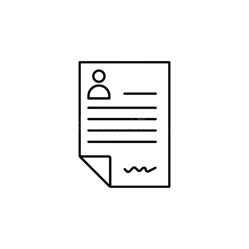
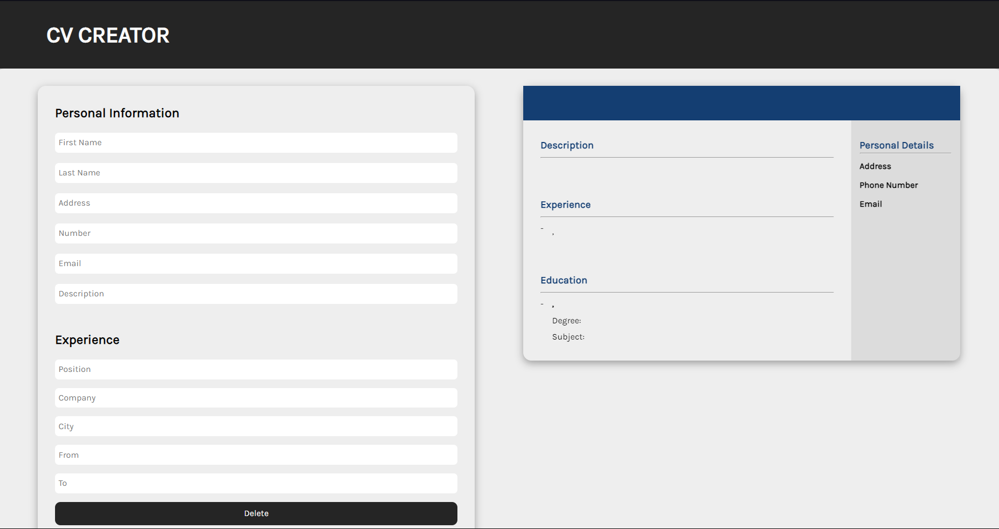

<!-- PROJECT LOGO -->

<br />
<div align="center">
  <a href="https://github.com/jaqubowsky/cv-application/">
    
  </a>

<h3 align="center">Resume builder</h3>

  <p align="center">
    Resume Builder App from <strong>The Odin Project</strong>
    <br />
    <br />
    <a href="https://inquisitive-eclair-4ece3a.netlify.app">View Demo</a>
    ·
    <a href="https://github.com/jaqubowsky/cv-application/">Report Bug</a>
    ·
    <a href="https://github.com/jaqubowsky/cv-application/issues">Request Feature</a>
  </p>
</div>


<!-- TABLE OF CONTENTS -->
<details>
  <summary>Table of Contents</summary>
  <ol>
    <li>
      <a href="#about-the-project">About The Project</a>
      <ul>
        <li><a href="#built-with">Built With</a></li>
        <li><a href='#design-from'>Design</li>
      </ul>
    </li>
    <li>
      <a href="#prerequisites">Prerequisites</a>
    </li>
    <li>
      <a href="#installation">Installation</a>
    </li>
    </li>
    <li><a href="#contact">Contact</a></li>
    <li>
      <a href="#left-to-do">Left to do</a>
    </li>
  </ol>
</details>

<!-- ABOUT THE PROJECT -->
## About The Project

<div align="center">
  <a href="https://inquisitive-eclair-4ece3a.netlify.app">
    
  </a>
  
<p align="right">(<a href="#readme-top">back to top</a>)</p>
</div>

### Built With

* ![React][React]
* ![Styled Components][Styled Components]
* ![Vite][Vite]
* ![NPM][NPM]

### Design from
* [The Odin Project](https://www.theodinproject.com)
<p align="right">(<a href="#readme-top">back to top</a>)</p>

<!-- GETTING STARTED -->
### Prerequisites

* npm
  ```sh
  npm install npm@latest -g
  ```

### Installation

1. Clone the repo
   ```sh
   git clone git@github.com:jaqubowsky/cv-application.git
   ```
2. Install NPM packages
   ```sh
   npm install
   ```
  
<p align="right">(<a href="#readme-top">back to top</a>)</p>

<!-- LEFT TO DO -->
### Left to do

<ul>
<li>nothing!</li>
</ul>

<!-- CONTACT -->
## Contact

Jakub Nalewajk - [@LinkedIn](https://www.linkedin.com/in/jakub-nalewajk/) - jakub.nalewajk04@gmail.com
<p align="right">(<a href="#readme-top">back to top</a>)</p>

<!-- MARKDOWN LINKS & IMAGES -->
<!-- https://www.markdownguide.org/basic-syntax/#reference-style-links. -->
[NPM]: https://img.shields.io/badge/NPM-%23000000.svg?style=for-the-badge&logo=npm&logoColor=white
[Webpack]: https://img.shields.io/badge/webpack-%238DD6F9.svg?style=for-the-badge&logo=webpack&logoColor=black
[Vite]: https://img.shields.io/badge/Vite-B73BFE?style=for-the-badge&logo=vite&logoColor=FFD62E
[JavaScript]: https://img.shields.io/badge/javascript-%23323330.svg?style=for-the-badge&logo=javascript&logoColor=%23F7DF1E
[HTML5]: https://img.shields.io/badge/html5-%23E34F26.svg?style=for-the-badge&logo=html5&logoColor=white
[CSS3]: https://img.shields.io/badge/css3-%231572B6.svg?style=for-the-badge&logo=css3&logoColor=white
[React]: https://img.shields.io/badge/react-%2320232a.svg?style=for-the-badge&logo=react&logoColor=%2361DAFB
[Styled Components]: https://img.shields.io/badge/styled--components-DB7093?style=for-the-badge&logo=styled-components&logoColor=white

